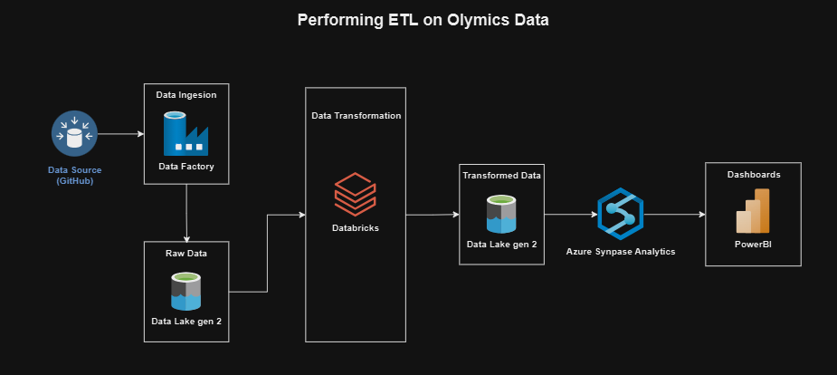

# 🚀 Tokyo Olympics Data ETL using Azure! 🚀

## Project Overview

This project involves performing a streamlined ETL (Extract, Transform, Load) operation using Azure Synapse on the Olympics data. Below is a detailed breakdown of the process:

### 1. Data Analysis and Architecture Design
- Analyzed the data across various tables and created an architecture diagram to illustrate the process flow.
- Designed and initiated the ETL process based on the data analysis.

### 2. Data Extraction
- Extracted raw data from GitHub using direct file paths to obtain the data in its raw form.

### 3. Data Ingestion
- Loaded the extracted data into Azure Data Lake Storage (ADLS) Gen2, providing scalable and secure storage for effective data management.

### 4. Mounting ADLS
- Mounted ADLS Gen2 to Azure Databricks, enabling seamless data access and transformation directly within Databricks.

### 5. ETL Operations and Orchestration
- Executed ETL operations using Azure Synapse, orchestrating data workflows for smooth data integration and transformation.
- Designed and managed data pipelines in Synapse to handle complex data transformations efficiently.

### 6. Data Transformation
- Utilized Azure Databricks for advanced data transformation, including data processing, cleaning, enrichment, and preparation.

### 7. Data Loading
- After transformation, loaded the processed data back into ADLS Gen2, making the cleaned and enriched data available for further use.

### 8. Dashboard Preparation
- Used the final transformed data to create dashboards, providing visualizations and reports for data-driven decision-making.

## Key Achievements
- **Scalability**: Developed a robust pipeline capable of handling large datasets efficiently.
- **Efficiency**: Enhanced ETL operations and data processing workflows, reducing time and resource consumption.

## Technologies Used
- **Azure Data Lake Storage (ADLS) Gen2**: Scalable and secure data storage.
- **Azure Databricks**: Advanced data transformation and processing.
- **Azure Synapse**: ETL operations and orchestration.
- **GitHub**: Data extraction.

## Architecture

## Synapse Pipeline diagram

## original dataset :https://www.kaggle.com/datasets/arjunprasadsarkhel/2021-olympics-in-tokyo

