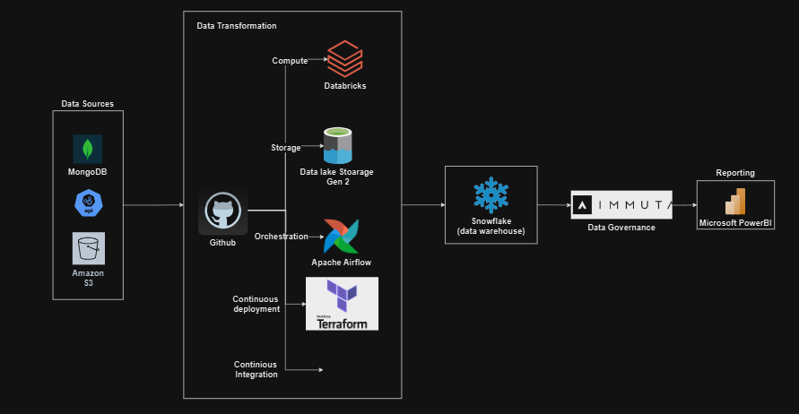

# Retail Technology Data Engineering Project

## Overview

This project involves extensive ETL operations for a B2B2C platform, focusing on seamless data connectivity between partners and customers. The goal is to ensure efficient data processing, organization, and reporting while adhering to security and compliance standards.

## Project Structure

### Key Components

1. **ETL Operations**
   - Managed and orchestrated ETL processes to handle large volumes of transactional data from multiple sources.

2. **Data Sources**
   - **Rest API**: Extracted data via RESTful APIs.
   - **AWS S3**: Retrieved data stored in Amazon S3 buckets.
   - **MongoDB**: Processed data from MongoDB collections.

3. **Data Transformation**
   - Utilized Python and Airflow to create and schedule data transformation jobs, ensuring raw data is converted into valuable insights.

4. **Data Processing & Storage**
   - Employed Databricks clusters for scalable data processing.
   - Maintained Medallion Architecture within Azure Blob Storage and a data lake environment for efficient data organization.

5. **Data Warehousing**
   - Loaded processed data into Snowflake, managing databases with various tables and views.
   - Implemented automated tasks for regular data syncing to ensure timely updates.

6. **Data Security & Compliance**
   - Applied Immuta policies to mask PII data, ensuring data security and compliance.

7. **Reporting & Analytics**
   - Analysed dynamic Power BI reports to analyze customer and partner activities, product performance, and revenue generation.
   - Collaborated with stakeholders to gather requirements and adjust reports to meet business needs.

8. **Testing & Documentation**
   - Conducted integration, data validation, and performance testing.
   - Supported user acceptance testing (UAT) and documented insights in Confluence.
   - Managed bug fixes through JIRA ticketing system.

## Tools & Technologies

- **Version Control**: GitHub
- **CI/CD**: CircleCI, Terraform
- **Data Processing**: Databricks, Python, Airflow
- **Data Storage**: Azure Blob Storage, Snowflake
- **Data Security**: Immuta
- **Reporting**: Power BI
- **Project Management**: JIRA, Confluence

## Workflow

1. **Data Extraction**: Data is collected from REST APIs, AWS S3, and MongoDB.
2. **Data Transformation**: Python-based transformations are scheduled and executed using Airflow.
3. **Data Processing**: Data is processed in Databricks clusters and organized in a Medallion Architecture within Azure Blob Storage.
4. **Data Loading**: Processed data is loaded into Snowflake, with automated tasks for syncing.
5. **Data Security**: PII data is masked using Immuta policies.
6. **Reporting**: Power BI reports are generated and analyzed for business insights.
7. **Testing**: Integration, validation, and performance testing are conducted, followed by UAT.

## Collaboration

- **Stakeholder Engagement**: Regularly collaborated with stakeholders to ensure alignment with business requirements.
- **Documentation**: Maintained detailed documentation of ETL processes and project insights in Confluence.

## Issue Tracking

- **Bug Fixes**: Managed and resolved issues through JIRA ticket management.

### Architecture
 
